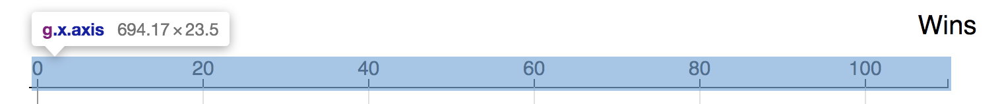
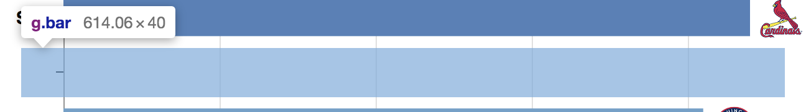
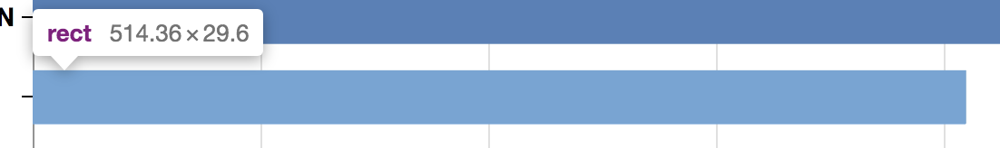
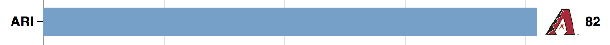

# D3 Workshop
## Introduction to D3
D3 is a javascript library for manipulating documents based on data and is often used in conjunction with software tools like HTML, SVG, and CSS. Essentially, it links data with what appears on the screen allowing the user to explore the information interactively. 
### Key Components
- #### HyperText Markup Language (HTML)
    - This is what web pages are made of and how you will ultimately present your information to the user. 
- #### Cascading Style Sheets (CSS)
    -  This describes the formatting of a document and will help with the presentation of the individual components.
- #### Javascript 
    - This is the code contained inside the HTML that makes up the dynamically represented data you will create.  
- #### Web Servers
    - This will allow you to access your HTML files and provides the structure that allows it to be displayed on a web browser. You can either set up a local server or get access to a remote one.

## Getting Started
The code we will be working with can be found at: https://github.com/caocscar/d3js-examples/tree/master/bar/sortable_timeseries


### Getting D3
To use D3, we must load the d3.js library into our HTML file from the CDN with the following code: 
<br>

```html
<script src="https://d3js.org/d3.v5.min.js"></script>
```
We'll also use the d3-array library to do some data wrangling to get the data in the right format:
```html
<script src="https://d3js.org/d3-array.v2.min.js"></script>
```

### Graph setup
Now, we will start working with our javascript file. We need to first set up our graph. The standard convention for setting up margins can be found at: https://bl.ocks.org/mbostock/3019563 
<br>
<br>
Let us follow along with our code. 
<br>
<br>
First define the `margin` object with properties for the four sides clockwise from the top with the following code:
```javascript
margin = {top: 80, right: 90, bottom: 30+50, left: 120}
```

Next define `width` and `height`as the inner dimensions of the chart area: 

```javascript
width = 900 - margin.left - margin.right
height = 1500 - margin.top - margin.bottom
```

Lastly, define `svg` as a SVG element with three attributes (class, width and height) and translate its the origin to the top-left corner of the chart area with a G element. 

```javascript
svg = d3.select('body').append('svg')
        .attr("class", "chart")
        .attr("width", width + margin.left + margin.right)
        .attr("height", height + margin.top + margin.bottom)
    .append("g")
        .attr("transform", "translate(${margin.left},${margin.top})")

```

### Loading in Data
Now that the graph has been created, we need to load in our data. Today we will be looking at total wins of baseball teams  

We will access the csv file through a url:

```javascript
const fileLocation = 'https://gist.githubusercontent.com/caocscar/8cdb75721ea4f6c8a032a00ebc73516c/raw/854bbee2faffb4f6947b6b6c2424b18ca5a8970e/mlb2018.csv'
```
Next we will parse the file, convert it into an array of objects and filter it by date, only taking in data entries before 4/3/2018. By this date, every team has won at least one game. 

```javascript
DATA = await d3.csv(fileLocation, type)
chartDate = new Date(2018,3,3)
data = filterData(chartDate)

```

`type` is a function we wrote that takes in the data and converts the date strings into numeric notation. Overall, it just makes the data loading process much easier. 

```javascript
function type(d) {
  const formatDate = d3.timeParse('%Y%m%d')
  d.date = formatDate(d.date)
  return d
}
```

`filterData` is also a function we wrote that takes in the data, iterates through it, counts how many games each team has won prior to the specified `chartDate`, and returns a new array with this information. 

```javascript
function filterData(chartDate) {
  const snapshot = DATA.filter(d => d.date <= chartDate)
  const wins = d3.rollup(snapshot, v => v.length, d => d.team) 
  return Array.from(wins, ([key, value]) => ({'team':key, 'value':value}))
}
```

## Adding Graph Details 

SVG stands for scalable vector graphics and up above, we defined and shifted our SVG graph. Now we will add axes.

`.append("g")` allows us to do this by appending a SVG group element to the already defined SVG element:

```javascript
svg.append("g")
        .attr("class", "x axis")
        .call(xAxis);

svg.append("g")
        .attr("class", "y axis")
        .call(yAxis);

xAxis = d3.axisTop(x)
        .ticks(6)

yAxis = d3.axisLeft(y)
        .tickFormat('')

```



In conjunction to the axes we want to add gridlines: 

```javascript
gridlines = d3.axisTop(x)
        .ticks(6)
        .tickSize(-height)
        .tickFormat("")

svg.append("g")			
          .attr("class", "grid")
          .call(gridlines)

```

As well as labels: 

```javascript
labels = svg.append('g')
        .attr('class', 'label')

xlabel = labels.append('text')
        .attr('transform', `translate(${width},-40)`)
        .text('Wins')

ylabel = labels.append('text')
        .attr('transform', 'translate(-80,${height/2}) rotate(-90)') 
        .text('Teams')

```

Besides these also need to define the FINISH THISSSS: 

```javascript
y = d3.scaleBand()
        .range([height, 0])
        .padding(0.33)
        .domain(data.map(d => d.team).reverse());


  x = d3.scaleLinear()
      .range([0, width]);
      .domain([0, Math.ceil(d3.max(data, d => d.value)/5)*5])
```

### Individual team bar charts 
Next we will start displaying our data in the graph. Ultimately, we want to show the progression of total games won for each baseball game over a period of time. Each team will be represented by a bar. 

To set up the groups, we must first create bars to contain the collective information for each team. 

In D3, instead of telling D3 what to do, think of it as you are telling D3 what you want. `svg.selectAll(".bar)` tells D3 you want bar elements to correspond to the data with one bar per datum. Then, create another SVG group element to space out the bars evenly: 

```javascript
svg.selectAll(".bar")
    .data(data)
    .join("g")
        .attr("class", "bar")
        .attr("transform", d => `translate(0,${y(d.team)})`)

```



Now we will add rectangles in each bar element with unique widths to display the total games won for each respective team. This is defined by `.attr("width", d => x(d.value))`:  

```javascript
rects = bar.append('rect')
        .attr("width", d => x(d.value))
        .attr("height", y.bandwidth())
    .style('fill', d => d3.interpolateRdYlBu(d.value/100))

```


Add labels to identify each team: 
```javascript
bar.append('text')
        .attr('class', 'team')
        .attr('x', -10)
        .attr('y', y.bandwidth()/2 + 5)
        .text(d => d.team)

```

As well as each team's logo: 

```javascript
const imgsize = 40
imgs = bar.append("svg:image")
        .attr('class', 'logo')
        .attr('x', d => x(d.value) + 5)
        .attr('y', -5)
        .attr('width', imgsize)
        .attr('height', imgsize)
        .attr("xlink:href", d => `http://www.capsinfo.com/images/MLB_Team_Logos/${urls[d.team]}.png`)

```

And lastly, a label for the number of games the team has won: 

```javascript
barLabels = bar.append('text')
        .attr('class', 'barlabel')
        .attr('x', d => x(d.value) + 10 + imgsize)
        .attr('y', y.bandwidth()/2 + 5)
        .text(d => d.value)

```




### Animating the graph

Since we want to display the progression of wins over a period of time, we want the graph to change as time passes so we must first display the date: 

```javascript
const formatDate = d3.timeFormat('%b %-d, %Y')
dateLabel = labels.append('text')
        .attr('id', 'date')
        .attr('transform', `translate(0,-40)`)
        .text(formatDate(chartDate))
```

Next, we will set up a variable T, which determines the time between each sorting transition in milliseconds. Every 300 milliseconds, the date label we set up above will change and update. We will also redefine the data based on the new date so we can get the cumulative games won prior to the new date. 

```javascript
const T = 300
dailyUpdate = setInterval(function() {

  chartDate = d3.timeDay.offset(chartDate,1)
  dateLabel.transition().duration(T)
          .text(formatDate(chartDate))
  data = filterData(chartDate)

```

Based on the interval T we set up, we also need to update the graph's axes to make them responsive to the changing scores. For the x axis we are incrementing by 5s: 

```javascript
x.domain([0, Math.ceil(d3.max(data, d => d.value)/5)*5]);

svg.select('.x.axis').transition().duration(T)
    .call(xAxis);
svg.select('.grid').transition().duration(T)
    .call(gridlines);
```

For the y axis we are just rearranging the team names based on the new order:

```javascript
y.domain(data.map(d => d.team).reverse());
bar.transition().duration(T)
        .attr("transform", d => `translate(0,${y(d.team)})`)
```

Next, we must also update each team's bar graph. 

As part of the animation, we include `.style('fill', d => d3.interpolateRdYlBu(d.value/100))` which defines the number of games won by each team as a fraction between 0 and 1. As teams win more games, the bar will gradually change from red to yellow to blue: 

```javascript
rects.data(data)
    .transition().duration(T)
        .attr("width", d => x(d.value))
        .style('fill', d => d3.interpolateRdYlBu(d.value/100))


```
As well as the positioning of the images: 

```javascript
imgs.data(data)
    .transition().duration(T)
        .attr('x', d => x(d.value) + 5)
```

And the label for the number of games won: 

```javascript
barLabels.data(data)
    .transition().duration(T)
        .attr('x', d => x(d.value) + 10 + imgsize)
        .attr('y', y.bandwidth()/2 + 5)
        .text(d => d.value)

```

And resort the data so it is shown in descending order: 

```javascript
data.sort((a,b) => d3.descending(a.value,b.value));
```