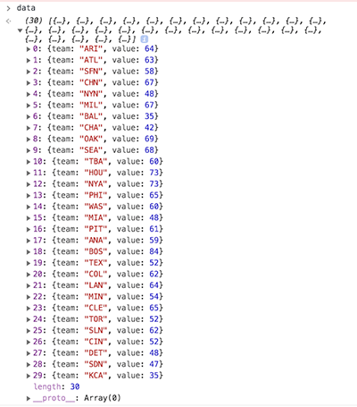

# D3 Workshop
## Introduction to D3
D3 (Data-Driven Documents or D3.js) is a javascript library for manipulating documents based on data and is used in conjunction with tools like HTML, SVG, and CSS. 
### Key Components
- HTML (HyperText Markup Language)
  - standard markup language for webpages
  - defines content
- CSS (Cascading Style Sheets)
  - language to describe the style of a HTML document
  - describes how HTML elements should be displayed
- JavaScript
  - scripting language for web pages 
  - lightweight, interpreted, or just-in-time compiled programming language
- SVG (Scalable Vector Graphics)
  - language for describing 2-D vector graphics in XML
- Web Server

## Getting Started
The code repository we will be working with can be found at: https://github.com/caocscar/d3js-examples/tree/master/bar/sortable_timeseries

The main files we will be working with are `index.html`, `sortable.js`, and `bar.css`. 

**Note**: I have other D3 examples in the github repo for those curious.

## Running Example Locally
To run D3 locally on your PC, you need to set up a web server. Fortunately, Python makes this relatively easy. Open a terminal that has access to Python and run a simple http server with the command `python -m http.server <port number>`. The port number is optional (default is 8000). Then open your browser and go to `localhost:8000` or `127.0.0.1:8000`. You should be able to see the example now.

### Getting D3
To use D3, we must load the d3.js library into our HTML file from the CDN with the following code: 

```html
<script src="https://d3js.org/d3.v5.min.js"></script>
```
We'll also use the d3-array library to do some data wrangling to get the data in the right format:
```html
<script src="https://d3js.org/d3-array.v2.min.js"></script>
```

### Graph setup
Let's take a quick peek at our HTML file. Its pretty bare bones. The things to note are:
- we load two JavaScript files `urls.js` and `sortable.js`
- we load one CSS file `bar.css`
- we make a JavaScript call to a function `createChart()` which will render our chart for us inside the body tag.
  
```html
<!DOCTYPE html>
<html lang="en">
<head>
  <meta charset="UTF-8">
  <script src="https://d3js.org/d3.v5.min.js"></script>
  <script src="https://d3js.org/d3-array.v2.min.js"></script>
  <script src="urls.js"></script>
  <script src="sortable.js"></script>
  <link rel="stylesheet" href="bar.css">
</head>
<body>
  <script>createChart()</script>
</body>
</html>
```

Now, we will start working with our JavaScript file `sortable.js` and create the function `createChart`. We need to first set up our graph. We start by specifying the dimension and margins of our graph. The standard D3 convention for setting up margins can be found at: https://bl.ocks.org/mbostock/3019563 

Let us follow along with our code. 

First define the `margin` object with properties for the four sides:
```javascript
let margin = {top: 80, right: 90, bottom: 30+50, left: 120}
```

Next define `width` and `height`as the inner dimensions of the chart area: 

```javascript
width = 900 - margin.left - margin.right
height = 1500 - margin.top - margin.bottom
```

Lastly, define `svg` as a SVG element with three attributes (`class`, `width`, and `height`) and translate its origin to the top-left corner of the chart area with a `g` element. 

```javascript
let svg = d3.select('body').append('svg')
    .attr("class", "chart")
    .attr("width", width + margin.left + margin.right)
    .attr("height", height + margin.top + margin.bottom)
  .append("g")
    .attr("transform", "translate(${margin.left},${margin.top})")
```
**Note**: There is a D3 distinction between a 2 space and 4 space indentation.

### Loading in Data
Now that the graphing area has been created, we need to load in our data. We will be looking at the 2018 baseball season and the accumulation of wins by each team.

The data resides in a Github gist. There is also a copy in our folder but I wanted to show you how to read from a url.

```javascript
const fileLocation = 'https://gist.githubusercontent.com/caocscar/8cdb75721ea4f6c8a032a00ebc73516c/raw/854bbee2faffb4f6947b6b6c2424b18ca5a8970e/mlb2018.csv'
```
Next we will parse the file, convert it into an array of objects and filter it by date (using `filterData` function). I choose April 4th as the start date as every team has won at least one game by then (helping avoid some complications).
```javascript
DATA = await d3.csv(fileLocation, type)
let chartDate = new Date(2018,3,3)
let data = filterData(chartDate)
```
**Note**: JavaScript starts month at index 0.

`type` is a function that takes in the data and parses the date strings into a JavaScript Date format.  
```javascript
function type(d) {
  const formatDate = d3.timeParse('%Y%m%d')
  d.date = formatDate(d.date)
  return d
}
```
**Note**: `d3.csv` reads in all columns as strings and you usually convert them to numeric in the `type` function. There is a `d3.autoType` function which is also available to do automatic conversions.

Here is the `filterData` function mentioned above. 
```javascript
function filterData(chartDate) {
  const snapshot = DATA.filter(d => d.date <= chartDate)
  const wins = d3.rollup(snapshot, v => v.length, d => d.team) 
  return Array.from(wins, ([key, value]) => ({'team':key, 'value':value}))
}
```
The function does some data wrangling for us.
1. Filters the data by date.
2. Performs a groupby operation by team and counts how many times they appear (or win) in the data.
3. Returns the data in the desired format for us (an `Array` of JavaScript Objects).

I could have done the data wrangling in another language like Python or R and created a different dataset to be read in but wanted to show you that D3 and JavaScript can also do similar things. Our data should look like this after being returned by filterData.



## Setting up D3 scales
Besides these also need to define the scaling for the axes. Since we are making a horizontal bar chart, we will utilize two scale functions: `scaleLinear` and `scaleBand`. `scaleLinear` creates a linear mapping while `scaleBand` is specific for bar charts. It will split the range into n (number of teams) bands and compute the positions and widths of the bands. 

```javascript
let y = d3.scaleBand()
    .domain(data.map(d => d.team).reverse())
    .range([height, 0])
    .padding(0.33)

let x = d3.scaleLinear()
    .domain([0, Math.ceil(d3.max(data, d => d.value)/5)*5])
    .range([0, width])
```
## Adding axes
We append a group element to the already defined SVG element using `.append("g")`.

```javascript
let xAxis = d3.axisTop(x)
    .ticks(6)

let yAxis = d3.axisLeft(y)
    .tickFormat('')
    
svg.append("g")
    .attr("class", "x axis")
    .call(xAxis);

svg.append("g")
    .attr("class", "y axis")
    .call(yAxis);
```


In addition to the axes, we want to add gridlines to the x-axis. 
```javascript
let gridlines = d3.axisTop(x)
    .ticks(6)
    .tickSize(-height)
    .tickFormat("")

svg.append("g")			
    .attr("class", "grid")
    .call(gridlines)
```

As well as labels for the axes. 
```javascript
labels = svg.append('g')
    .attr('class', 'label')

labels.append('text')
    .attr('transform', `translate(${width},-40)`)
    .text('Wins')

ylabel = labels.append('text')
    .attr('transform', `translate(-80,${height/2} rotate(-90)`) 
    .text('Teams')
```

### Individual team bar charts 
Next we will start displaying our data in the graph. Ultimately, we want to show the progression of total games won for each baseball game over a period of time. Each team will be represented by a bar. 

To set up the groups, we must first create bars to contain the collective information for each team. 

In D3, instead of telling D3 what to do, think of it as you are telling D3 what you want. The following piece of code constructs bars for each of the teams.

```javascript
let bar = svg.selectAll(".bar")
  .data(data)
  .join("g")
    .attr("class", "bar")
    .attr("transform", d => `translate(0,${y(d.team)})`)
```
Here's a breakdown of the above code block:
- `svg.selectAll(".bar)` says you want to select all element of type class bar (even if they don't exist at the start)
- `.data(data)` binds the data to the D3 selection
- `.join(g)` creates `g` elements for each data point (i.e. team)

Then for each `g` element:
- `.attr('class', 'bar')` assigns `class="bar"`
- `.attr("transform", d => 'translate(0,${y(d.team)})')` assigns a transformation (x,y)


Now we will add rectangles to each bar element and set the bar width corresponding to the wins for each respective team. `.attr("width", d => x(d.value))`
We style the bar using `.style('fill', d => d3.interpolateRdYlBu(d.value/100))` which defines the number of games won by each team as a fraction between 0 and 1. We will add a chromatic scheme to visually show as teams win more games, the bar will gradually change from red to yellow to blue.
```javascript
let rects = bar.append('rect')
    .attr("width", d => x(d.value))
    .attr("height", y.bandwidth())
    .style('fill', d => d3.interpolateRdYlBu(d.value/100))
```


More information on chromatic schemes can be found here: 
https://observablehq.com/@d3/color-schemes?collection=@d3/d3-scale-chromatic

Let's add labels to identify each team. 
```javascript
bar.append('text')
    .attr('class', 'team')
    .attr('x', -10)
    .attr('y', y.bandwidth()/2 + 5)
    .text(d => d.team)
```

As well as logos for each team. 
```javascript
const imgsize = 40
let imgs = bar.append("svg:image")
    .attr('class', 'logo')
    .attr('x', d => x(d.value) + 5)
    .attr('y', -5)
    .attr('width', imgsize)
    .attr('height', imgsize)
    .attr("xlink:href", d => `http://www.capsinfo.com/images/MLB_Team_Logos/${urls[d.team]}.png`)
```

And a label for the number of games the team has won.
```javascript
let barLabels = bar.append('text')
    .attr('class', 'barlabel')
    .attr('x', d => x(d.value) + 10 + imgsize)
    .attr('y', y.bandwidth()/2 + 5)
    .text(d => d.value)
```


And lastly, we add the date to display the time frame. 
```javascript
const formatDate = d3.timeFormat('%b %-d, %Y')
let dateLabel = labels.append('text')
    .attr('id', 'date')
    .attr('transform', `translate(0,-40)`)
    .text(formatDate(chartDate))
```

## Exercise #1
Lets review what we've learned with an exercise. 

Go into the exercises folder in the code repository and open up simple.js. Upon running this on a server you should see: 


Our goal is to transform this horizontal bar chart into a vertical bar chart with the number values outside of the bars. So, something like this: 


To approach this we can split it up into a couple steps: 

1. Switching from a bar chart horiziontal to vertical is essentially changing the scaling of the axes. Try using scaleBand for x and scaleLinear for y and change the ranges appropriately. 

2. Next we must switch the range of data in the domain. How should we do that?

3. We also have to consider how the rectangles are appended. What is the new height and width? What is the new x and y? 

4. Lastly position the bar labels accordingly. 

## Animating the graph

Now that we have an idea of how the graph set up and plotting works, we will dive into animation. Going back to our inital example, the animation happens within HTML's `setInterval()` method.  The `setInterval()` method calls a function at specified intervals (in our case, `T`). Our function will perform one transition every interval.

For each transition, we need to do the following:
- update the date 
- re-construct a new dataset up to current date
- update the x-axis and gridlines
- update the bar chart
- sort the data and update the y-axis

Here we set up the period, `T`, and assign a variable name to our setInterval method. The first thing we do is increment the date by one day and then update the `dateLabel` variable with new text.

```javascript
const T = 300
let dailyUpdate = setInterval(function() {
  chartDate = d3.timeDay.offset(chartDate,1)
  dateLabel.text(formatDate(chartDate))
// ...    
}, T);
```

We need to update our dataset with our new date.
```javascript
data = filterData(chartDate)
```

We also need to update the graph's axes to make them responsive to the changing scores. We do this by updating the `x.domain` and then re-calling the `xAxis` and `gridlines` variables which are dependent on the variable `x`. 

For the x-axis, we are incrementing the scale by fives (arbitrary). D3 also has a `.nice()` method which you can add to let D3 choose a "nice" limit for you.

```javascript
x.domain([0, Math.ceil(d3.max(data, d => d.value)/5)*5]);
svg.select('.x.axis').transition().duration(T)
    .call(xAxis);
svg.select('.grid').transition().duration(T)
    .call(gridlines);
```

Here we update each team's bar graph. We attach our updated dataset to `rects`. We then re-specify the `width` attribute and `fill` style. If we did just this, this would actually give it the effect of stop-motion animation. We add the `.transition().duration(T)` part to smooth the transition. Similarly, we do the same for the logos and the bar labels. For the logos, we just need to update the `x` attribute and for the labels, we need to update the `x, y, text` attributes.
```javascript
rects.data(data)
  .transition().duration(T)
    .attr("width", d => x(d.value))
    .style('fill', d => d3.interpolateRdYlBu(d.value/100))

imgs.data(data)
  .transition().duration(T)
    .attr('x', d => x(d.value) + 5)

barLabels.data(data)
  .transition().duration(T)
    .attr('x', d => x(d.value) + 10 + imgsize)
    .attr('y', y.bandwidth()/2 + 5)
    .text(d => d.value)
```

For the y-axis, we need to update the `y.domain`. But we need to sort our new dataset first. We then update our `bar` variable by changing the `transform` attribute. 
```javascript
data.sort((a,b) => d3.descending(a.value,b.value));
y.domain(data.map(d => d.team).reverse());
bar.transition().duration(T)
    .attr("transform", d => `translate(0,${y(d.team)})`)
```
Recall that the `bar` variable points to a group of `g` elements where we have grouped a bunched of other elements together. This has the advantage of allowing us to make one call to move them all instead of multiple separate calls. These elements include the rectangle, team text, logo, and bar label. 

[TODO] Add screenshot of `g` element with 4 nested elements.

[TODO] Add blurb about exit function

## Exercise #2
### Part A 
For this exercise, we will start with the solution from Exercise #1. 
### Part B 
[TODO] Instructions

## References
[TODO] Add D3 references